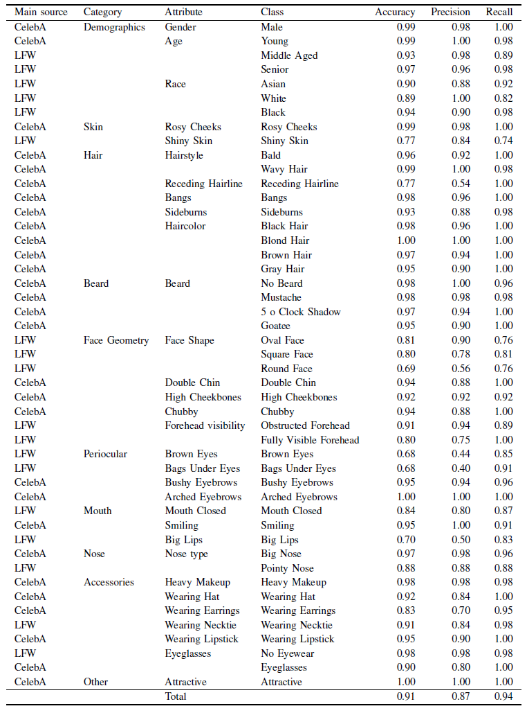

# MAAD-Face: A Massively Annotated Attribute Dataset for Face Images

Version 1.0 (23.09.2020)

## Table of Contents

- [Abstract](#abstract)
- [Database Properties](#properties)
- [Annotated Sample Images](#annotated-sample-images)
- [Download](#download)
- [Citing](#citing)
- [Acknowledgment](#acknowledgment)
- [License](#license)


## Abstract

Soft-biometrics play an important role in face recognition and related fields since these might lead to biased performances, threatens the user, or are valuable for commercial aspects. Current face database are specifically constructed for the development of face recognition applications. Consequently, these databases contain large amount of diverse face but lack in the number of attribute annotations and the overall annotation correctness. In this work, we propose MAAD-Face, a new face database that is characterized by the large number of its high-quality attribute annotations. MAAD-Face consists of 3.3M faces of over 9k individuals. Using a novel annotation transfer-pipeline that allows an accurate label-transfer from multiple source-datasets to a target-dataset, MAAD-Face consists of 123.9M attribute annotations of 47 different binary attributes. Consequently, it provides 15 and 137 times more attribute labels than CelebA and LFW. Our investigation on the annotation quality by three human evaluators demonstrated the superiority of the MAAD-Face annotations over the other databases. Finally, we make use of the large amount of high-quality annotations from MAAD-Face to study the usefulness of soft-biometrics for recognition, providing insights about which attributes support genuine and imposter decision.

## Properties

MAAD-Face consists of over 3.3M face images from over 9k different subjects. It provides attribute labels for 47 soft-biometric attributes with a total number of 123.9M attribute annotations. Consequently, it provides 15 and 137 times more attribute labels than CelebA and LFW. Moreover, three human evaluators analysed the correctness of the attribute annotations for CelebA, LFW and MAAD-Face. As shown in the Table below, it does not only provide more attribute annotation but also  annotations of higher quality than the other investigated databases.


The results of the human evaluation for each attribute of MAAD-Face is shown below.



## Annotated Sample Images

Below some sample images are shown including their corresponging 47 attribute annotations.
A positive attribute label refers to 1, a negative attribute label refers to -1, and a undefined attribute annotation is marked as 0.


## Download

## Citing

TODO 

If you use this code, please cite the following papers.


```
@inproceedings{DBLP:conf/cvpr/TerhorstKDKK20,
  author    = {Philipp Terh{\"{o}}rst and
               Jan Niklas Kolf and
               Naser Damer and
               Florian Kirchbuchner and
               Arjan Kuijper},
  title     = {{SER-FIQ:} Unsupervised Estimation of Face Image Quality Based on
               Stochastic Embedding Robustness},
  booktitle = {2020 {IEEE/CVF} Conference on Computer Vision and Pattern Recognition,
               {CVPR} 2020, Seattle, WA, USA, June 13-19, 2020},
  pages     = {5650--5659},
  publisher = {{IEEE}},
  year      = {2020},
  url       = {https://doi.org/10.1109/CVPR42600.2020.00569},
  doi       = {10.1109/CVPR42600.2020.00569},
  timestamp = {Tue, 11 Aug 2020 16:59:49 +0200},
  biburl    = {https://dblp.org/rec/conf/cvpr/TerhorstKDKK20.bib},
  bibsource = {dblp computer science bibliography, https://dblp.org}
}
```

```
@inproceedings{DBLP:conf/btas/TerhorstHKZDKK19,
  author    = {Philipp Terh{\"{o}}rst and
               Marco Huber and
               Jan Niklas Kolf and
               Ines Zelch and
               Naser Damer and
               Florian Kirchbuchner and
               Arjan Kuijper},
  title     = {Reliable Age and Gender Estimation from Face Images: Stating the Confidence
               of Model Predictions},
  booktitle = {10th {IEEE} International Conference on Biometrics Theory, Applications
               and Systems, {BTAS} 2019, Tampa, FL, USA, September 23-26, 2019},
  pages     = {1--8},
  publisher = {{IEEE}},
  year      = {2019},
  url       = {https://doi.org/10.1109/BTAS46853.2019.9185975},
  doi       = {10.1109/BTAS46853.2019.9185975},
  timestamp = {Mon, 14 Sep 2020 18:11:03 +0200},
  biburl    = {https://dblp.org/rec/conf/btas/TerhorstHKZDKK19.bib},
  bibsource = {dblp computer science bibliography, https://dblp.org}
}
```

If you make use of MAAD-Face, please additionally cite the [VGGFace2](http://www.robots.ox.ac.uk/~vgg/data/vgg_face2) database since MAAD-Face is build on it.


## Acknowledgment
This work was supported by the German Federal Ministry of Education and Research (BMBF) as well as by the Hessen State Ministry for Higher Education, Research and the Arts (HMWK) within the National Research Center for Applied Cybersecurity (ATHENE), and in part by the German Federal Ministry of Education and Research (BMBF) through the Software Campus project.


## License

This project is licensed under the terms of the Attribution-ShareAlike 4.0 International ([CC BY-SA 4.0](https://creativecommons.org/licenses/by-sa/4.0/)) license.
Copyright (c) 2020 Fraunhofer Institute for Computer Graphics Research IGD Darmstadt
